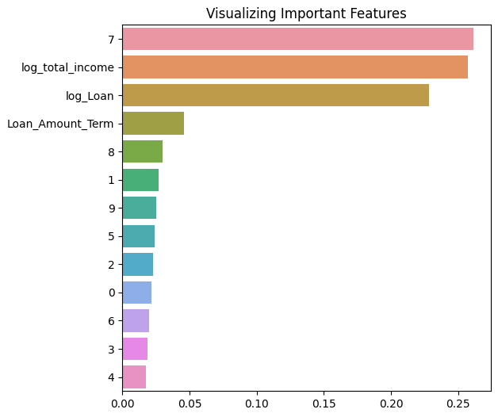
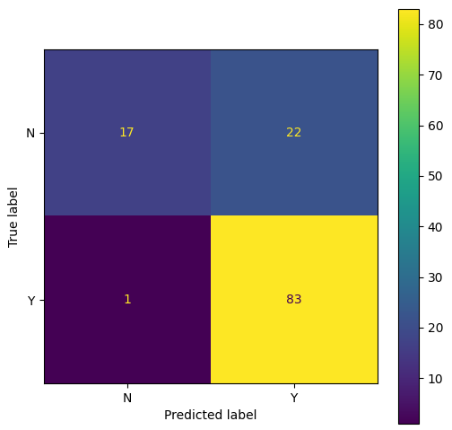

# Mini-project IV

### [Assignment](assignment.md)

## Project/Goals
This project attempts to build a machine learning model to predict whether or not an applicant will be approved for a loan. Once I have successfully created a model, I will deploy it to the cloud to run on AWS.

## Hypothesis
Loans are more likely to be approved for applicants with:
- higher income
- credit history
- higher education
- lower loan amount requests

## EDA 
Through my EDA, I saw there was a skew to both income features as well as the LoanAmount feature.

I also noticed a propotionally large number of missing values, almost 150 in total. Given that the total dataset was only 614 rows, this is a significant amount of data that will need to be imputed.

The target variable, Loan_Status, has an imbalance: 422 Approved and 192 Not Approved. This may need to be addressed with oversampling. 

## Process
1. EDA
2. Data Cleaning - imputing null values (median for numeric and mode for categorical features)
3. Feature Engineering - log transformation of LoanAmount, create TotalIncome from sum of ApplicantIncome and CoaaplicantIncome, then log transformation of TotalIncome, One Hot Encoding of categorical features.
4. Model Training and Hyperparameter Tuning - I trained both a Random Forest and Naive Bayes Classifier. The Naive Bayes had slightly higher accuracy, so that was my final model.
5. Create a pipeline for the data preparation, model training and hyperparameter tuning.
6. Deploy model with Flask
7. Test deployed model

## Results/Demo
My final model was a Naive Bayes Classifier with an accuracy score of 0.813. 
It can be accessed by sending a post request to [this link](ec2-35-182-37-241.ca-central-1.compute.amazonaws.com:5000/predict) with the new data in the body as a JSON. Any NaN values should be converted to a string 'NaN' before submitting.

 

  

The numbered features refer to encoded categorical features:
- 0 - Gender
- 1 - Married
- 2-4 - Dependents
- 5 - Education
- 6 - Self_Employed
- 7 - Credit_History
- 8-9 - Property_Area

 

## Confusion Matrix

## Challanges 
One of the main challenges I faced in this project was getting the steps into the pipeline in a way that worked. I had to resolve issues with doing different transformations to different columns at various points in the process when earlier steps returned arrays instead of dataframes. Once, I had the model running locally, it also took some effort to get it running in the cloud because of differences in versions of the libraries used.

Another challenge was the small dataset. The model was trained on just under 500 observations. With more training data, the model could be more robust.

## Future Goals
Next steps in this project would be to adjust the model some to improve the recall performance.

After that, develop some sort of user interface for the deployed model that would make it more accessible to future users. 